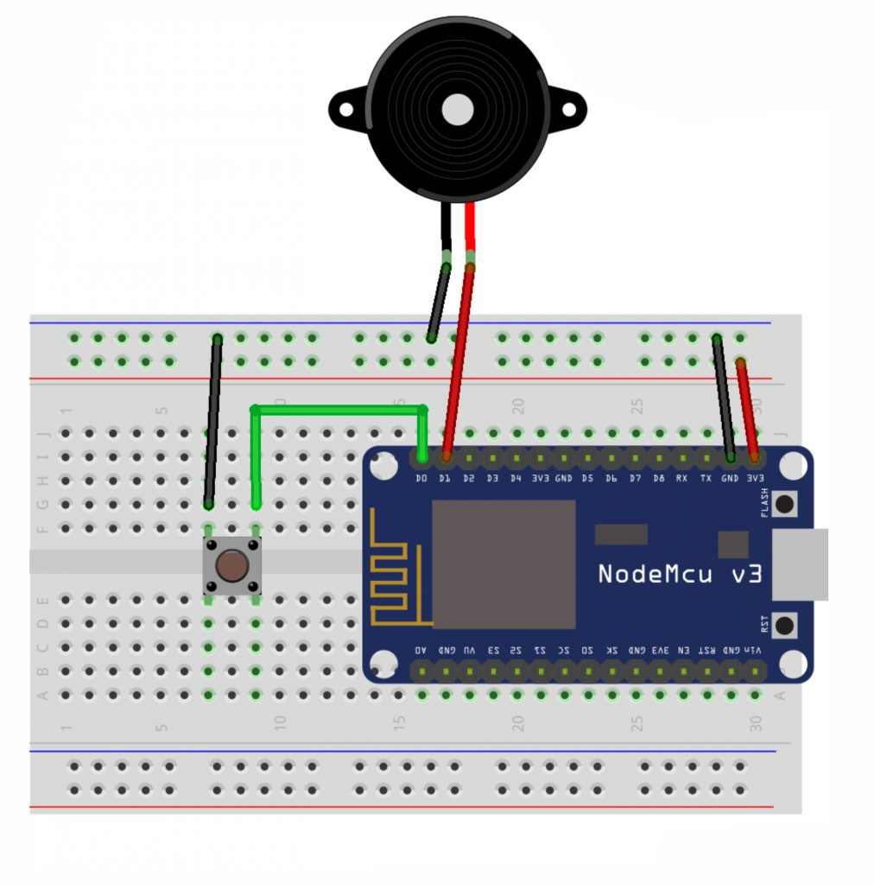
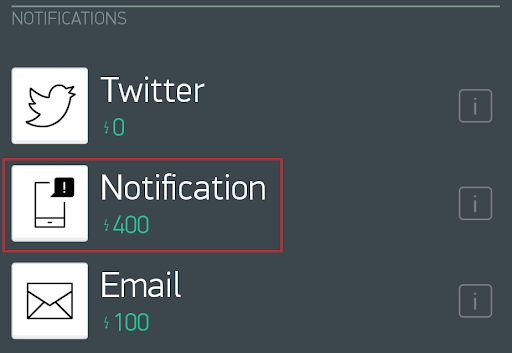

# Blynk IoT Doorbell

## Description

- An electric buzzer is an electronic component that can convert electrical signals into sound vibrations. In general, the buzzer, which is an audio device, is often used in anti-theft circuits, alarms on watches, house bells, reverse warnings on trucks and other danger warning devices.

## Circuit Schematic

- Below you can see a schematic image to facilitate the wiring of cables from the microcontroller to devices, both input and output sensors:



## Component (Tools & Materials):

- NodeMCU ESP8266: 1 unit;
- Breadboard: 1 unit;
- Pushbutton: 1 unit;
- Buzzer: 1 unit;

## Sketch Program

```cpp
#define BLYNK_PRINT Serial
#include <ESP8266WiFi.h>
#include <BlynkSimpleEsp8266.h>

char auth[] = "XXXX";
char ssid[] = "Veendy-Suseno";
char pass[] = "Admin12345";

int buzzer = D1;
int tomb = D0;

void setup() {
    pinMode(buzzer, OUTPUT);
    pinMode(tomb, INPUT_PULLUP);
    Serial.begin(9600);
    Blynk.begin(auth, ssid, pass);
}

void loop() {
    int push = digitalRead(tomb);
    if (push == LOW)  {
        tone(buzzer, 1000, 200);
        Blynk.notify("Bel Berbunyi");
    } else  {
        noTone(buzzer);
    }
    delay(100);
    Blynk.run();
}
```

## BLYNK Settings:

- Use the Notification type Widget Box
   <br/>
- Image of Notification Box Widget selection

## Interface:

 <br/>

- Image of the BLYNK Home Bell interface

## Conclusion :

- In this project, the NodeMCU is connected to the Blynk application wirelessly and is used as a doorbell. If the button is pressed, a buzzer will sound and a notification will appear in the Blynk application.
  <br/>
